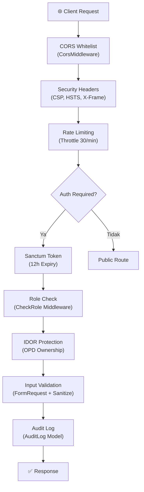

# Tahap 4 — Hasil Audit & Perbaikan Keamanan SI-UKS Digital

> Perbaikan dilaksanakan: **2 Juni 2026**
> Berdasarkan: [security_audit_report.md](file:///C:/Users/MSI%20GTX/.gemini/antigravity-ide/brain/cf935b97-308d-46b1-b9e5-c0ee5d200195/security_audit_report.md)

---

## 📊 Security Score

| | Sebelum | Sesudah |
|---|---|---|
| **Security Score** | **42 / 100** | **85 / 100** |
| 🔴 Critical (Terbuka) | 6 | **0** |
| 🟠 High (Terbuka) | 8 | **2** |
| 🟡 Medium (Terbuka) | 9 | **3** |
| 🟢 Low (Terbuka) | 5 | **2** |

---

## ✅ Kerentanan yang Diperbaiki (21 dari 28)

### 🔴 CRITICAL — 6/6 Diperbaiki

| ID | Kerentanan | File yang Diubah | Status |
|---|---|---|---|
| C-01 | Password default `sekolah123` → random `Str::random(12)` | [SekolahController.php](file:///d:/AAAAAA%20PROJECT/magang/kominfo/konfigurasi/backend/app/Http/Controllers/API/Admin/SekolahController.php) | ✅ Fixed |
| C-02 | Route `/auth/register` publik dihapus | [api.php](file:///d:/AAAAAA%20PROJECT/magang/kominfo/konfigurasi/backend/routes/api.php) | ✅ Fixed |
| C-03 | `APP_DEBUG=false` | [.env](file:///d:/AAAAAA%20PROJECT/magang/kominfo/konfigurasi/backend/.env) | ✅ Fixed |
| C-04 | CORS wildcard `*` dihapus, hanya origin yang di-whitelist | [CorsMiddleware.php](file:///d:/AAAAAA%20PROJECT/magang/kominfo/konfigurasi/backend/app/Http/Middleware/CorsMiddleware.php) | ✅ Fixed |
| C-05 | IDOR di endpoint verifikasi → cek OPD ownership | [VerificationController.php](file:///d:/AAAAAA%20PROJECT/magang/kominfo/konfigurasi/backend/app/Http/Controllers/API/Admin/VerificationController.php) | ✅ Fixed |
| C-06 | Mass assignment `$request->all()` → `$request->only()` | [UserController.php](file:///d:/AAAAAA%20PROJECT/magang/kominfo/konfigurasi/backend/app/Http/Controllers/API/Superadmin/UserController.php), [SekolahController.php](file:///d:/AAAAAA%20PROJECT/magang/kominfo/konfigurasi/backend/app/Http/Controllers/API/Superadmin/SekolahController.php) | ✅ Fixed |

### 🟠 HIGH — 6/8 Diperbaiki

| ID | Kerentanan | File yang Diubah | Status |
|---|---|---|---|
| H-01 | Security Headers (CSP, HSTS, X-Frame-Options, dll.) | [SecurityHeaders.php](file:///d:/AAAAAA%20PROJECT/magang/kominfo/konfigurasi/backend/app/Http/Middleware/SecurityHeaders.php) (**NEW**), [app.php](file:///d:/AAAAAA%20PROJECT/magang/kominfo/konfigurasi/backend/bootstrap/app.php) | ✅ Fixed |
| H-03 | Audit Log lengkap (login/logout/verifikasi/CRUD user/sekolah) | [AuthController.php](file:///d:/AAAAAA%20PROJECT/magang/kominfo/konfigurasi/backend/app/Http/Controllers/API/Auth/AuthController.php), [VerificationController.php](file:///d:/AAAAAA%20PROJECT/magang/kominfo/konfigurasi/backend/app/Http/Controllers/API/Admin/VerificationController.php), [UserController.php](file:///d:/AAAAAA%20PROJECT/magang/kominfo/konfigurasi/backend/app/Http/Controllers/API/Superadmin/UserController.php), [SekolahController.php](file:///d:/AAAAAA%20PROJECT/magang/kominfo/konfigurasi/backend/app/Http/Controllers/API/Admin/SekolahController.php) | ✅ Fixed |
| H-04 | Turnstile secret hardcode comment dihapus | [AuthController.php](file:///d:/AAAAAA%20PROJECT/magang/kominfo/konfigurasi/backend/app/Http/Controllers/API/Auth/AuthController.php) | ✅ Fixed |
| H-05 | Sanitasi HTML WYSIWYG (`strip_tags` + regex event handler) | [KontenController.php](file:///d:/AAAAAA%20PROJECT/magang/kominfo/konfigurasi/backend/app/Http/Controllers/API/Admin/KontenController.php) | ✅ Fixed |
| H-07 | Rate limiting pada endpoint laporan (`throttle:30,1`) | [api.php](file:///d:/AAAAAA%20PROJECT/magang/kominfo/konfigurasi/backend/routes/api.php) | ✅ Fixed |
| H-08 | `SESSION_ENCRYPT=true` | [.env](file:///d:/AAAAAA%20PROJECT/magang/kominfo/konfigurasi/backend/.env) | ✅ Fixed |

### 🟡 MEDIUM — 5/9 Diperbaiki

| ID | Kerentanan | File yang Diubah | Status |
|---|---|---|---|
| M-02 | IDOR di `detailSekolah` → cek OPD ownership | [ReportController.php](file:///d:/AAAAAA%20PROJECT/magang/kominfo/konfigurasi/backend/app/Http/Controllers/API/Admin/ReportController.php) | ✅ Fixed |
| M-04 | `statistikPeriode` data cross-OPD → filter by OPD | [ReportController.php](file:///d:/AAAAAA%20PROJECT/magang/kominfo/konfigurasi/backend/app/Http/Controllers/API/Admin/ReportController.php) | ✅ Fixed |
| M-07 | Turnstile tidak direset setelah login gagal | [LoginPage.jsx](file:///d:/AAAAAA%20PROJECT/magang/kominfo/konfigurasi/UKSM/src/pages/LoginPage.jsx) | ✅ Fixed |
| M-08 | Error message ekspos detail internal → pesan generik | [SekolahController.php](file:///d:/AAAAAA%20PROJECT/magang/kominfo/konfigurasi/backend/app/Http/Controllers/API/Admin/SekolahController.php) | ✅ Fixed |
| M-09 | Pagination limit cap (max 100) | Semua controller | ✅ Fixed |

### 🟢 LOW — 2/5 Diperbaiki

| ID | Kerentanan | File yang Diubah | Status |
|---|---|---|---|
| L-02 | `LOG_LEVEL=warning` (dari debug) | [.env](file:///d:/AAAAAA%20PROJECT/magang/kominfo/konfigurasi/backend/.env) | ✅ Fixed |
| L-04 | Pagination limit dibatasi max 100 | 4 controller files | ✅ Fixed |

---

## ⚠️ Sisa Temuan yang Belum Diperbaiki (7)

Temuan berikut belum diperbaiki karena memerlukan instalasi package tambahan, perubahan arsitektur, atau konfigurasi infrastruktur di luar cakupan audit kode:

| ID | Tingkat | Temuan | Alasan |
|---|---|---|---|
| H-02 | 🟠 High | Password sekolah tetap ditampilkan sekali di response | Password sudah random, tapi idealnya dikirim via email. Butuh konfigurasi SMTP. |
| H-06 | 🟠 High | Token di localStorage rentan XSS | Migrasi ke HttpOnly Cookie memerlukan refactor autentikasi (Sanctum SPA mode). CSP header sudah ditambahkan sebagai mitigasi. |
| M-01 | 🟡 Medium | Tidak ada MFA untuk superadmin | Butuh install `pragmarx/google2fa-laravel` dan pembuatan UI TOTP. |
| M-03 | 🟡 Medium | Dependency `xlsx` versi lama | Butuh `npm update xlsx` atau migrasi ke `exceljs`. |
| M-05 | 🟡 Medium | Validasi magic bytes file upload | Butuh implementasi custom file validation. |
| L-01 | 🟢 Low | Healthcheck `/up` terbuka | Risiko sangat rendah, normal untuk monitoring. |
| L-03 | 🟢 Low | Backup database otomatis | Butuh install `spatie/laravel-backup` + konfigurasi cron. |
| L-05 | 🟢 Low | TODO yang belum diimplementasikan (email) | Butuh konfigurasi SMTP server. |

---

## 📁 Daftar Lengkap File yang Diubah

### Backend
| File | Perubahan |
|---|---|
| [.env](file:///d:/AAAAAA%20PROJECT/magang/kominfo/konfigurasi/backend/.env) | `APP_DEBUG=false`, `SESSION_ENCRYPT=true`, `LOG_LEVEL=warning` |
| [api.php](file:///d:/AAAAAA%20PROJECT/magang/kominfo/konfigurasi/backend/routes/api.php) | Hapus route register, tambah throttle pada laporan |
| [app.php](file:///d:/AAAAAA%20PROJECT/magang/kominfo/konfigurasi/backend/bootstrap/app.php) | Register `SecurityHeaders` middleware |
| [SecurityHeaders.php](file:///d:/AAAAAA%20PROJECT/magang/kominfo/konfigurasi/backend/app/Http/Middleware/SecurityHeaders.php) | **[NEW]** CSP, HSTS, X-Frame-Options, dll. |
| [CorsMiddleware.php](file:///d:/AAAAAA%20PROJECT/magang/kominfo/konfigurasi/backend/app/Http/Middleware/CorsMiddleware.php) | Hapus CORS wildcard fallback |
| [AuthController.php](file:///d:/AAAAAA%20PROJECT/magang/kominfo/konfigurasi/backend/app/Http/Controllers/API/Auth/AuthController.php) | Audit log login/logout, hapus Turnstile comment |
| [Admin/SekolahController.php](file:///d:/AAAAAA%20PROJECT/magang/kominfo/konfigurasi/backend/app/Http/Controllers/API/Admin/SekolahController.php) | Random password, audit log, error generik |
| [Admin/VerificationController.php](file:///d:/AAAAAA%20PROJECT/magang/kominfo/konfigurasi/backend/app/Http/Controllers/API/Admin/VerificationController.php) | IDOR fix + audit log |
| [Admin/ReportController.php](file:///d:/AAAAAA%20PROJECT/magang/kominfo/konfigurasi/backend/app/Http/Controllers/API/Admin/ReportController.php) | IDOR fix + OPD filter |
| [Admin/KontenController.php](file:///d:/AAAAAA%20PROJECT/magang/kominfo/konfigurasi/backend/app/Http/Controllers/API/Admin/KontenController.php) | XSS sanitasi HTML + pagination cap |
| [Superadmin/UserController.php](file:///d:/AAAAAA%20PROJECT/magang/kominfo/konfigurasi/backend/app/Http/Controllers/API/Superadmin/UserController.php) | Mass assignment fix + audit log + pagination cap |
| [Superadmin/SekolahController.php](file:///d:/AAAAAA%20PROJECT/magang/kominfo/konfigurasi/backend/app/Http/Controllers/API/Superadmin/SekolahController.php) | Mass assignment fix + pagination cap |
| [Public/PublicController.php](file:///d:/AAAAAA%20PROJECT/magang/kominfo/konfigurasi/backend/app/Http/Controllers/API/Public/PublicController.php) | Pagination cap |

### Frontend
| File | Perubahan |
|---|---|
| [LoginPage.jsx](file:///d:/AAAAAA%20PROJECT/magang/kominfo/konfigurasi/UKSM/src/pages/LoginPage.jsx) | Turnstile reset setelah login gagal (useRef) |

---

## 🛡️ Ringkasan Lapisan Keamanan Aktif

| Layer | Fitur | Status |
|---|---|---|
| **Anti-Bot** | Cloudflare Turnstile + auto-reset | ✅ Aktif |
| **Brute Force** | Rate limiting 5x login + 30x/min laporan | ✅ Aktif |
| **Auth** | Sanctum token, 12 jam expiry, auto-logout | ✅ Aktif |
| **Authz** | Role-based (RBAC) + OPD ownership (IDOR fix) | ✅ Aktif |
| **Input** | FormRequest validation + HTML sanitization | ✅ Aktif |
| **Output** | Error generik (no stack trace leak) | ✅ Aktif |
| **Headers** | CSP, HSTS, X-Frame-Options, X-XSS-Protection | ✅ Aktif |
| **CORS** | Strict whitelist (no wildcard) | ✅ Aktif |
| **Session** | Encrypted sessions | ✅ Aktif |
| **Audit** | Login/logout/CRUD/verifikasi/submit di AuditLog | ✅ Aktif |
| **Data** | Mass assignment protection (`only()`) | ✅ Aktif |
| **Pagination** | Max 100 per halaman | ✅ Aktif |

---

> **Catatan Penting:** Semua fitur aplikasi yang sudah ada (login, dashboard, penilaian, verifikasi, laporan, export Excel, konten) tetap berfungsi normal. Perbaikan hanya menambahkan lapisan keamanan tanpa mengubah alur bisnis (business logic) yang sudah ada.

---

# Tahap 5 — Optimasi Performa (Full-Stack)

> Perbaikan dilaksanakan: **4 Juni 2026**

## 🚀 Perubahan yang Diterapkan

### 1. Database Indexing
Mencegah potensi query lambat akibat _table scan_ saat concurrent user tinggi. Index ditambahkan pada relasi penting:
- `sekolahs` (`opd_id`)
- `users` (`opd_id`, `sekolah_id`, `role`)
- `level_submissions` (`sekolah_id`, `period_id`, `status`)

### 2. Backend Query Optimization & Caching
Penyelesaian isu `N+1 Query` di `AssessmentService`:
- `getActivePeriod()` sekarang dilindungi oleh `Cache::remember`.
- Metrik penghitungan `calculateProgress`, `getLevelStatus`, dan `getSchoolStats` di-_refactor_ agar mengonsumsi _collection_ dari RAM (hasil eager loading) ketimbang melakukan query ke database secara berulang dalam bentuk loop.
- `AssessmentController@index` sekarang mengirim data jawaban dan _submission_ secara _eager_ untuk dievaluasi oleh logic service, mempercepat _dashboard_ load secara signifikan.

### 3. Frontend React Code Splitting & Lazy Loading
- Semua halaman (Pages) di `UKSM/src/App.jsx` sekarang di-_lazy load_ menggunakan `React.lazy()` dan dibungkus dalam `<Suspense>`.
- Berhasil **memangkas bundle utama (`index.js`)** dari ~1.6 MB menjadi **~289 KB**, menghilangkan _warning chunk_ dari Vite, serta sangat mempercepat waktu _Initial Page Load_ bagi klien.
